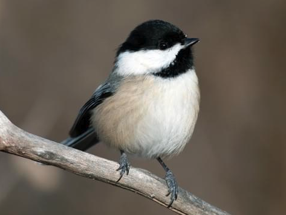
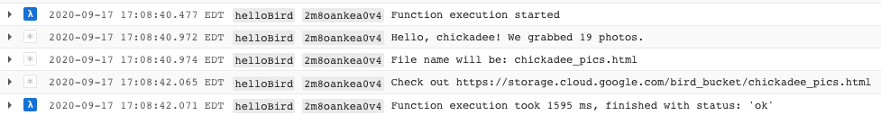

# BirdWatcher 



An example repo showing how to write a Google Cloud Function that is:
- Triggered by a PubSub 
- Makes an API call to enrich data 
- Writes the enriched data to a Google Cloud Storage bucket


## Before You Start

> This demo assumes you are familiar with the Google Cloud Platform console 

You will need ... 
- A Google Cloud Platform account
- A GCP project created with:
    - billing enabled
    - PubSub, Storage, Cloud Functions APIS enabled
    - A GCS Bucket
    - A Pubsub topic
- `gcloud` cli (authenticated with the account that holds the project, and the project set as the default)    
- An [Unsplash](https://unsplash.com/documentation#creating-a-developer-account) developer account, registered app, and access key

### Clone this project 

```sh
git clone https://github.com/kaylakantola/birdwatcher.git && cd birdwatcher && npm i
```
### Create an env vars file 

At the root of your project...
```sh
touch .env.yaml
```

Put your Unsplash access key & GCS bucket name in there:
```yaml
UNSPLASH_ACCESS_KEY: <YOUR_KEY_HERE>
GCS_BUCKET: <YOUR_BUCKET_NAME_HERE>
```

## Deploy the function 

From the root of the repo, run this command, replacing `<YOUR_PUBSUB_TOPIC>` with your pubsub topic.

```sh
 gcloud functions deploy helloBird --env-vars-file .env.yaml --runtime nodejs10 --trigger-topic <YOUR_PUBSUB_TOPIC> 
```

This may take a few minutes, and eventually it will deploy. You should be able to see it here (replace `<YOUR_PROJECT_ID_HERE>` with your project id):

`https://console.cloud.google.com/functions/details/us-central1/helloBird?project=<YOUR_PROJECT_ID_HERE>&tab=general`

Once it's deployed, publish a message to your pubsub topic (replacing `<YOUR_PUBSUB_TOPIC>` with your pubsub topic).

```sh
gcloud pubsub topics publish <YOUR_PUBSUB_TOPIC> --message chickadee
```

You can do a different bird other than `chickadee` if you want. Chickadees are just awesome.

After you publish the message, go to the console and look at the logs for your cloud function. You should see this (may take a minute to show up):



In the logs you can see the link to where the enriched data ends up in google cloud storage. Follow that link to see cool bird pics!

## You did it!

You ...
1. published a message to a pubsub topic containing a bird name 
2. set up a cloud function that gets triggered by the pubsub topic
3. used the coud function to enrich the data by ...
    - calling the unsplash api and getting images related to the bird name
    - creating an html file with those images
4. putting that html file in a GCS storage bucket

Good job!

